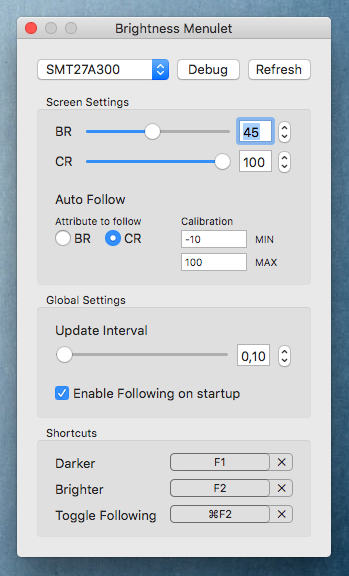

# Brightness Menulet 

Allows you to control monitor brigthness via menu in status bar.

 

**Note:** This tool works on OSX 10.8+. In 10.8+, I2C tools are not able to detect monitor buses for communication. If you have tested your monitor(s) with this tool, please let me know wether it worked or not so I can add monitor models here. Preference's Debug button logs to the console VCP codes and their values on the selected monitor.

---

## Features

-   Following the internal Display's Brightness (if automatic brightness is activated in the system preferences this follows the light sensor as well)
-   Auto-Follow is indicated by highlighting the status bar icon
-   Auto-Follow can be calibrated to support displays with different brightness
-   Multi-Monitor support
-   Key bindings for Darker, Brighter and toggle the Follow-Main-Screen option
-   Compatible with OSX 10.8+

## Download

If you don't want to build the app yourself, you can download a build version [here](http://github.com/florianbeck/brightnessmenulet/releases).

## Monitors

###### Working

* Dell U2014h
* Dell U2414h
* Dell U2415h
* Dell U2515H
* Dell U2715h
* Dell U2713HM
* Dell P2415Q
* Dell S2216M
* Samsung SA350
* BenQ G2410HD
* Viseo 230Ws
* Samsung SMT27A300
* LG 34UC87M (connection: Thunderbolt)
* LG 27UD88-W

###### Non-Working

* Dell P2715Q
* Philips 4065UC
* Dell P2412H
* Dell U2412M 
* HP Z23i
* DELL U2717D (partially)

If you have tested your monitor(s) with this tool, please let me know
whether or not it work and I will update this list.

## Roadmap

-   Support for other monitor makes
-   Time based settings
-   Fading between Auto-Follow values

## Credits

If you like this menulet, please use [this link](http://amazon.florianbeck.de) for your next purchase on amazon to support me.

-   [Kalvin126](https://github.com/Kalvin126) &
    [superduper](https://github.com/superduper) —
    [BrightnessMenulet](https://github.com/Kalvin126/BrightnessMenulet)
    creators
-   [Alec Jacobson](http://www.alecjacobson.com/weblog/) — first version
    of [Brightness Menulet
    app](http://www.alecjacobson.com/weblog/?p=1127)
-   [wagenet](http://github.com/wagenet) – DDC Update 
-   Jon Taylor — [DDC/CI
    bindings](https://github.com/jontaylor/DDC-CI-Tools-for-OS-X)
-   Victor Miroshnikov — copy&paste&debug job
-   [Joey Korkames](https://github.com/kfix/ddcctl) — EDID Reading
-   [shpakovski](https://github.com/shpakovski) —
    [MASShortcut](https://github.com/shpakovski/MASShortcut)-Framework
